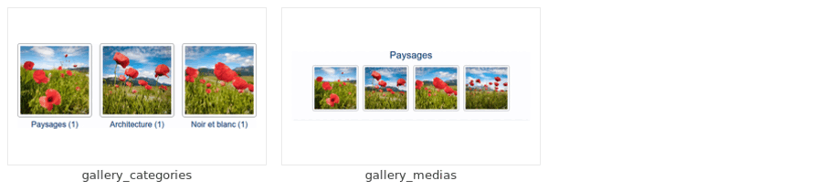

# GalleryBundle

Symfony bundle providing photo galleries on the c975L core — categories and medias (photos and videos from any platform UiBundle declares), with batch upload, automatic thumb/medium/highres derivatives and a public viewer.

[](https://github.com/975L/GalleryBundle/blob/master/LICENSE)
[](https://packagist.org/packages/c975l/gallery-bundle)
[](https://packagist.org/packages/c975l/gallery-bundle)
[](https://app.codacy.com/gh/975L/GalleryBundle/dashboard)

## Why GalleryBundle


Add GalleryBundle on top of [c975L/CoreBundle](https://github.com/975L/CoreBundle) (ConfigBundle + UiBundle, one package) and get a photo gallery — no dependency on [SiteBundle](https://github.com/975L/SiteBundle), [ShopBundle](https://github.com/975L/ShopBundle) or any other satellite bundle, so it drops into any c975L site that needs one. Multi-size derivatives reuse UiBundle's own `VichMultiSizeImageInterface` pattern rather than duplicating it.

See it in action at [bundles.975l.com/pages/gallery-bundle](https://bundles.975l.com/pages/gallery-bundle), and browse every block kind live in the [block gallery](https://bundles.975l.com/pages/block-gallery).

---

> **TL;DR** — Photo galleries as `GalleryCategory` → `GalleryMedia`, managed from EasyAdmin, with bulk upload and automatic thumb/medium/highres derivatives. The category is the top-level unit: a site's galleries are its categories. Depends only on CoreBundle.

## Contents

- **Setup** — [requirements](#requirements) · [installation](#installation) · [configuration](#load-the-configuration) · [routes](#enable-routes) · [assets](#install-assets) · [theme](#install-the-theme)
- **Using it** — [public routes](#public-routes) · [linking from a menu](#linking-a-gallery-from-a-menu) · [the automatic galleries](#the-automatic-galleries) · [renaming a category](#renaming-a-category) · [deleting a gallery](#deleting-a-gallery) · [masking a gallery](#masking-a-gallery) · [selling prints](#selling-prints) · [uploading a batch](#uploading-a-batch) · [renaming a media](#renaming-a-media) · [a media's caption](#a-medias-caption) · [fields of your own](#fields-of-your-own) · [browsing and the lightbox](#browsing-and-the-lightbox) · [editing from the public pages](#editing-from-the-public-pages) · [blocks](#blocks-defined-by-this-bundle) · [category summary](#a-categorys-summary) · [share image](#the-image-a-shared-page-carries) · [category headings](#composing-a-categorys-heading) · [theme tokens](#theme) · [videos](#videos) · [trashing a selection](#trashing-a-selection-of-medias) · [credits / rights on a selection](#applying-credits-or-rights-to-a-selection) · [moving a selection](#moving-a-selection-to-another-gallery) · [downloading a selection](#downloading-a-selections-files) · [export / import categories](#export--import-categories) · [sitemap and health check](#sitemap-and-health-check) · [describing the gallery index](#describing-the-gallery-index) · [backup](#backup) · [what's new](#whats-new) · [guided projects](#guided-projects)
- **Operating** — [likes on a photo](#likes-on-a-photo) · [seeding a demo gallery](#seeding-a-demo-gallery) · [bringing an existing gallery in](#bringing-an-existing-gallery-in) · [upload ceilings](#upload-ceilings) · [AI agent skills](#ai-agent-skills)

## Features

- A heart under a photo, behind one setting: visitors like it without an account, and the page says how many did (see [likes on a photo](#likes-on-a-photo)).
- `GalleryCategory` → `GalleryMedia`: the category is the top-level unit, a site's galleries being its categories - no container above them.
- Bulk upload: pick every file at once from the category they belong to, with a title root, credits and rights-reserved applied to the whole batch, retouched one media at a time afterwards. The same batch is offered on the category creation form, so a category is created with its medias in one go. Optionally, the untouched originals are kept outside the document root (see [uploading a batch](#uploading-a-batch)). The screen counts the megabytes as they leave and then says the files are being processed, a batch being minutes of waiting.
- Three derivatives generated automatically per uploaded image (thumbnail / medium / highres), all three holding the whole photo, via UiBundle's `VichImageResizeListener` and the `VichMultiSizeImageInterface` contract - naming and resizing stay centralized in UiBundle, this bundle only declares the target sizes and how its grids frame them (see [Thumbnail framing](#thumbnail-framing)).
- One EasyAdmin menu entry ("Gallery", opening the categories, with their media count); a category's medias are listed under its own edit form, each thumbnail opening the media it stands for, and medias are added from the category itself.
- Each media in that list carries a checkbox, so a selection of them goes to the trash in one go instead of one edit screen at a time (see [trashing a selection](#trashing-a-selection-of-medias)), or given the same credits and rights at once (see [credits / rights on a selection](#applying-credits-or-rights-to-a-selection)), or moved into another gallery with everything they carry (see [moving a selection](#moving-a-selection-to-another-gallery)), or their files handed back as one zip (see [downloading a selection](#downloading-a-selections-files)).
- A catch-all "Non classé" category is created lazily so an imported media always has one, even without a real one to attach it to.
- One category of the site can be turned into **the gallery of the last additions**: it holds no media of its own and shows what every other category received on its last days of upload, whatever gallery each photo landed in - as a public page, as a block, and as a back-office screen where a whole upload session is credited, downloaded or trashed in one go (see [the automatic galleries](#the-automatic-galleries)).
- A public front-office viewer (index → category → media), browsed entirely in the stored (medium) resolution, with circular previous/next navigation whose neighbouring images are preloaded in the background so switching medias never shows a blank image while it loads. The high resolution opens in a lightbox over the image, fetched only when the visitor asks for it (see [browsing and the lightbox](#browsing-and-the-lightbox)).
- Two block kinds contributed to UiBundle, so a gallery can be shown on any page composed in the back office instead of only under its own routes (see [blocks](#blocks-defined-by-this-bundle)).
- A category owns UiBundle blocks of its own, giving it an editorial heading above its grid (see [category headings](#composing-a-categorys-heading)).
- A category carries a rich-text summary, printed above its grid and reused as the page's social/search metas (see [summary](#a-categorys-summary)).
- Every gallery page hands one of its own photos to a social network as its `og:image`, rather than the site's logo — a shared gallery shows what it holds (see [share image](#the-image-a-shared-page-carries)).
- Videos sit in the same categories as the photos: an entry becomes one by carrying the url of the page it is watched on, or a video file of the site's own, and each carries its own uploaded still, so one grid holds both kinds. YouTube, TikTok, Vimeo and Dailymotion are recognized, any other player being framed as pasted (see [videos](#videos)).
- The bundle's own stylesheet and theme file, reading UiBundle's admin-editable colors and fonts, so a gallery looks like the site it is installed on without a line of CSS (see [theme](#theme)).
- Sitemap generation (gallery index, categories and media pages), via ConfigBundle's `SitemapProviderInterface`
- The gallery index listed in the "Descriptions d'urls" screen, via ConfigBundle's `UrlMetadataProviderInterface`, ready to be described without anyone typing its path (see [describing the gallery index](#describing-the-gallery-index))
- The gallery index and each category offered as a SiteBundle menu target, so a navbar links straight to one of the site's galleries (see [linking a gallery from a menu](#linking-a-gallery-from-a-menu))
- Categories can be exported/imported as a zip (heading blocks, medias and files bundled in), plugging into ConfigBundle's **Export sync (everything)** dashboard shortcut and **Import content** screen.
- The two upload roots declared to the backup, via ConfigBundle's `BackupPathProviderInterface`, mirrored offsite rather than tarred (see [backup](#backup))
- Six replayable guided projects contributed to the dashboard, via ConfigBundle's `GuidedProjectProviderInterface`, walking a gallery's creation, its medias' arrangement, a media's own screen, the trash and the way back out of it, the files handed back as an archive, and the gallery of the latest additions (see [guided projects](#guided-projects))
- Photographs can be **sold as prints**, behind one setting: a catalogue of sizes and prices, an order plugged into PaymentBundle's basket, and a lab that prints and ships to the customer directly - nothing transiting through the shopkeeper. A photograph can be offered as a limited edition, the bundle holding the register so the last copy cannot be sold twice, and drawing the certificate of authenticity to sign, with a qr code to its public verification page.
- A photograph can be **hidden** from every public page without being deleted, and hiding it or putting it on sale applies to a whole selection at once.
- A whole gallery can be **hidden** the same way: it leaves the index, the blocks, the menus and the sitemap, its photographs leave the automatic galleries with it, and everything stays in the back office to be shown again (see [masking a gallery](#masking-a-gallery)).
- Each gallery carries its own **QR code** on its edit screen, built on `site-url`, to print on a card, a flyer or an exhibition label.
- A skill written for the coding agents of the sites installing this bundle, shipped in the package and read straight from `vendor/` (see [AI agent skills](#ai-agent-skills))

---

## Requirements

- PHP >= 8.4
- Symfony ^8.0
- [c975L/CoreBundle](https://github.com/975L/CoreBundle) in `^1.14.0` — ConfigBundle and UiBundle ship as the single `c975l/core-bundle` package, so requiring this bundle pulls both (Vich naming/resizing, EasyAdmin form-theme conventions, stylesheet registry, page layout fallback, menu provider, scaffold, sitemap and health checks). `^1.14.0` is what reads the role a menu entry states, without which the gallery's own sidebar entry falls back on the admin bar and an editor never sees it
- Doctrine ORM
- EasyAdmin
- VichUploader Bundle
- `symfony/expression-language`, which the public routes' condition is evaluated with (see [public routes](#public-routes)) — pulled in by Composer
- [c975L/PaymentBundle](https://github.com/975L/PaymentBundle) in `^6.2` — the one basket a print is bought through. Required rather than suggested so the print shop is there to be switched on, instead of being a feature nobody knows exists
- `endroid/qr-code` in `^6` — the qr code of a certificate and of a gallery

`GalleryMedia::$user` is typed against `c975L\ConfigBundle\Contract\UserInterface`: your `App\Entity\User` must implement it. The scaffolded `User` already does; an older one adds the `implements` itself, with no migration and no configuration change.

---

## Installation

### Download

```bash
composer require c975l/gallery-bundle
```

### Run migrations

```bash
php bin/console doctrine:migrations:diff
php bin/console doctrine:migrations:migrate
```

### Load the configuration

```bash
php bin/console c975l:config:load-all
```

Seeds the bundle's `config/configs.json` into ConfigBundle's **Configuration** screen, under a **Gallery**
group of its own. It holds the gallery's [url prefix](#public-routes), editable from there like every
other setting of this ecosystem — nothing of this bundle is configured in the app's yaml.

### Enable routes

Add the bundle's public routes to `config/routes.yaml`:

```yaml
c975_l_gallery:
    resource: "@c975LGalleryBundle/src/Controller/"
    type: attribute
    prefix: /
```

Templates ``, same convention as this ecosystem's other public-facing
bundles (e.g. BookBundle) - override any of them from your app's
`templates/bundles/c975LGalleryBundle/`.

### Install assets

```bash
php bin/console assets:install --symlink
```

Nothing to register by hand, front or back. The bundle ships two Stimulus entrypoints, each starting its
own app: `controllers.js` for the public pages (previous/next preloading, the high-resolution lightbox,
the right click/drag blocking) and `controllers-admin.js` for the back office (the upload screen's batch
check, see [upload ceilings](#upload-ceilings)). Both are auto-registered through UiBundle's script
registry, and their `importmap.php` entries are written by `ImportmapProvider` the first time you
`composer update` after installing the bundle — `php bin/console c975l:config:check-importmap` reports
any that is missing.

### Install the theme

```bash
php bin/console c975l:scaffold:install
```

Copies `assets/styles/themes/gallery.css` into the app, where it is owned from then on (see
[theme](#theme)).

---

## Usage

### Public routes

| Route | URL | Description |
| --- | --- | --- |
| `gallery_index` | `/gallery` | Gallery index, one thumbnail per category |
| `gallery_category` | `/gallery/{category}` | Category grid, photos and videos alike |
| `gallery_media` | `/gallery/{category}/{slug}` | Media: photo in medium resolution, or video embed |
| `gallery_print_certificate` | `/certificate/{certificate}` | Public check page of one numbered print (see [selling prints](#selling-prints)) |
| `gallery_print_file` | `/gallery-print-file/{copy}` | The print file, fetched by the lab through a signed url |

The first segment is the **Gallery url prefix** setting (`gallery-route-prefix`, group **Gallery** in
**Configuration**), so a site serves these routes in its own language — `galerie`, `fotos` — renamed from
the dashboard, with no yaml and **no cache to clear**: the change applies on the very next request.

The first three are the ones the prefix applies to. A route path is compiled into the router's cache, so
the prefix can't *be* the path: they are declared as `/{gallery_prefix}/…`, carrying it as a route
parameter instead, and each of the three carries a condition asking `Routing\GalleryRoutePrefix` whether
the segment it was handed is the configured one. Any other value simply doesn't match, and the router carries on with the rest of the
site's routes — without that check, `/{gallery_prefix}/{category}` would swallow every two-segment url of
the site. Generating a url is the mirror image: `Listener\GalleryRoutePrefixListener` puts the configured
prefix in the router's request context, which is where the generator takes a route parameter it wasn't
given from, so `path('gallery_category', {category: ...})` keeps taking the category alone.

Leading and trailing slashes are ignored, and an empty value falls back to `gallery` rather than mounting
the category route at the site root — as does a prefix not configured at all, before
`c975l:config:load-all` has run. `GallerySitemapProvider` reads the same service, so the declared urls
always match what the router serves; it does so directly rather than through the generator, the sitemap
being written from the command line where no request has filled the context. Route *names* never change,
whatever the prefix.

The two print routes are deliberately **outside** the prefix: `gallery_print_certificate` is printed on
paper and has to outlive a rename, and `gallery_print_file` is never read by a visitor.

**Renaming the prefix breaks the previous urls**, which then 404. If they were indexed, declare a redirect
— ConfigBundle's **Redirections** screen takes one.

### Linking a gallery from a menu

`Management\LinkableRouteProvider` offers these routes to SiteBundle's menus (**Menus** in the dashboard,
navbar / footer / email header / email footer): the **target** select of a menu item lists the gallery
index alongside the site's pages, and **one entry per category** — the categories being the site's
galleries, an item usually points straight at one of them.

A category is listed there as **Galerie - Paysages**, so the galleries are found at a glance among every
page of the site and sit together once the list is sorted; the rendered navbar item reads **Paysages**,
the category's own title, the prefix being of no use in a bar.

A category entry is keyed on the category's **id**, so renaming the category, changing its slug or
renaming the route prefix leaves no menu item behind: only the target is stored, the url being generated
at each render and the label read from the category's own title. Deleting a category simply drops its
items from the rendered menu, as it does for any target that no longer resolves.

The item's own **label** field overrides that title, for a category whose name is too long to sit in a
navbar.

### The automatic galleries

**The gallery of the last additions is a gallery of its own, and nobody creates it.** A photo library is
arranged by subject - Animaux, Arbres, Fleurs - so an upload session is dispatched across a dozen
categories at once, and nothing on the site says a single photo has arrived. **Derniers ajouts** is the one
screen that shows them all: `GalleryCategoryRepository::findOrCreateAutomatic()` writes it the first time
the galleries are listed - the back-office listing, the public index or a categories block, whichever comes
first - and it is a normal category from then on, flagged `GalleryCategory::$automaticKind`. Rename it,
describe it, give it a heading, move it up or down the index: it takes everything a gallery takes. It is
never an option carried by one of your own galleries, which ticking a box on *Animaux* would turn into
something it isn't.

**What it shows is a rolling window of calendar days**, today included
(`GalleryMediaRepository::findLatest()`, driven by `Service\GalleryLatestProvider`), settled by the two
configuration entries of the **Galerie** group:

| Entry | Default | What it decides |
| --- | --- | --- |
| `gallery-latest-days` | `7` | How many days back the gallery reaches, today counting as one of them |
| `gallery-latest-max` | `200` | The ceiling. Past it, only the most recent medias are shown |

**It is never empty as long as the site holds a photo**: a window that catches nothing - nothing published
for a week - falls back on the last day that does carry an addition, and on that day alone. Without it, a
site publishing once a month would show an empty gallery three weeks out of four, and its tile would simply
vanish from the index, having no photo left to draw itself with.

The ceiling is what keeps the day a whole library came in at once, a migration or an import, from being
served whole: it also bounds each query the gallery costs, which the index on `gallery_media.created_at`
answers. Past it the most recent medias are the ones kept, the list being ordered by date of addition.

**On the public site it is a gallery like any other**: same route, same template, same grid, its own
summary, its own [heading blocks](#composing-a-categorys-heading), its own tile on the index (showing its
newest photo rather than one at random), a [menu target](#linking-a-gallery-from-a-menu) and a line in the
sitemap. Its thumbnails link each photo **under its own category** - `/{prefix}/objets/objet-1`, never a
second path to the same photo - with `?from=<its slug>` over it, which is what says the visitor is walking
the last additions rather than the gallery filing that photo. The media page reads it: previous and next
are then the medias added just before and just after, whatever category they sit in, and the breadcrumb
leads back to the last additions. A photo that has since left the window is browsed as its own category's
again, and ConfigBundle's `canonical_url()` drops the query string, so the canonical url stays the media's
own. Its slug is picked like any other category's, the shipped one being `latest`. Pointing a
[**Galerie - médias** block](#blocks-defined-by-this-bundle) at it puts the site's last additions on the
home page.

**In the back office its edit screen is the cross-gallery selection screen**: the same grid, cut into one
section per day of additions, each thumbnail naming the gallery the photo actually belongs to and opening
its edit form. The selection toolbar is the one every category carries - [credits and
rights](#applying-credits-or-rights-to-a-selection), [downloads](#downloading-a-selections-files),
[move to trash](#trashing-a-selection-of-medias) - and each of them acts on the photo where it really sits:
trashing one from here takes it out of its own gallery, cover included. What is left out is what belongs to
the owning category alone: no upload button, no drag to reorder, no cover radio, no trash view of its own.

**Moving it to the trash is how a site says it doesn't want it**, the same button every other gallery
carries: `findOrCreateAutomatic()` leaves a trashed one exactly where it was put, where the catch-all
"Non classé" is lifted back out. Restore it and it is back, with the additions of the moment. An imported
archive carrying the flag only takes it on a site that holds no such gallery at all, trash included, so an
import never leaves two of them behind.

**It is one kind of automatic gallery, not the only one.** A site selling prints gets a second one, the
photographs on offer (`GalleryCategory::AUTOMATIC_PRINTABLE`, see [selling prints](#selling-prints)),
which behaves in every way described above and simply gathers on another rule. Everything a category
needs around a list it doesn't own - being written the first time it is looked for, taking its place on
the index, being handed to a tile, giving a media its neighbours - is `Service\GalleryAutomaticProvider`'s,
written once for every kind. Each kind only answers what it gathers, through
`Contract\AutomaticGalleryInterface`: `getKind()`, `isAvailable()` and `getMedias()`. A site gathering
its photographs on a rule of its own - a tag, a year, a rating - writes that one class and has a gallery
of it on the index, in the menus and in the sitemap, with nothing to tag and no screen to teach.

A kind answering `false` to `isAvailable()` is never written at all, which is how the prints gallery
stays absent from a site that doesn't sell any, rather than sitting empty on its index.

### Renaming a category

A category's slug is what `/{prefix}/{category}` is built from, so renaming a category moves its public
url. The title field asks for confirmation before it takes a single keystroke (UiBundle's `title-confirm`
controller, over EasyAdmin's own confirmation modal), and the slug is then rebuilt from the new title —
EasyAdmin's `SlugField` stops following its target field as soon as the slug holds a value, so on an edit
form nothing would resync it otherwise. Editing the slug by hand stays possible through the padlock, and a
slug already taken is refused by the form rather than silently suffixed.

Either way, the old url is not left to 404: `GalleryCategoryCrudController::updateEntity()` writes a
permanent redirect to the new one, in ConfigBundle's **Redirections**, reusing the row a previous rename
left behind rather than piling them up. Renaming a category back to what it was drops the redirect that
would otherwise point the other way, so the two never loop. This mirrors what SiteBundle does for a page.

The category's slug is also the segment above each of its medias, so a rename moves their urls too: a
second, wildcarded row (`/{prefix}/{old-slug}/*`, ConfigBundle's own convention) sends them to the renamed
category rather than leaving each media to 404.

### Deleting a gallery

**Deleting takes two deliberate steps, and the first one loses nothing.** A category is moved to the
trash from its own edit screen — at the foot of it, deliberately (see
[where that button sits](#where-the-gallerys-own-delete-button-sits)) — as well as from the listing's row
button, EasyAdmin's own confirmation modal standing in the way either way. What that writes is a flag and nothing else
(`GalleryCategory` carries CoreBundle's `TrashableTrait`): the category leaves the site, its medias, its
heading blocks and every one of their files stay exactly where they are — the cascade on
`GalleryCategory::$medias` and `Listener\GalleryMediaDerivativeCleanupListener` are simply never reached.

The listing's **Corbeille** button switches it to what it holds, and back. There, a category carries two
actions of its own: **Restaurer**, which puts it back untouched, and **Supprimer définitivement**, which
is the one that removes the row, its medias, its heading blocks, their three derivatives and any kept
original — and the directory the category grouped its files under, in `public/` and in `private/`, once
it is actually empty. That one is held at `site-role-admin`, the rest of the gallery sitting at
`site-role-editor`: it is the only irreversible action of the screen.

**Exporting still works from the trash**, deliberately: a category can be carried to another site, or
kept aside as an archive with all of its files, before it is dropped for good (see *Export / import
categories*).

The catch-all **"Non classé"** category shows no delete button anywhere: it is what a media uploaded
without a real category falls back to, so it has to survive (`GalleryCategory::$uncategorized`, a flag
rather than a slug, so translating or editing its title changes nothing). Flagged as trashed some other
way — a fixture, an import — `GalleryCategoryRepository::findOrCreateUncategorized()` lifts it back out.

**A trashed category or media answers 410 Gone**, not 404, and answers it from the row itself
(`GalleryController::resolveCategory()`, the same shape SiteBundle serves a trashed `Page` with). That
410 lasts exactly as long as the entity can still be restored.

**The permanent deletion is what declares the url gone for good.** Every category page and every media
page is declared in the sitemap (`Sitemap\GallerySitemapProvider`), and a 410 is what drops a url from an
index, where a 404 is retried for months. `Service\GalleryUrlRedirector` writes the rows in ConfigBundle's
**Redirections**: one for the deleted url, plus a single wildcarded one (`/{prefix}/{slug}/*`) covering
every media of a deleted category rather than a row per media. The rows that redirected to that url answer
the same 410 directly, so nothing points at a page that is gone. Nothing is written at the move to trash:
a url that can still come back must not be declared gone.

Restoring a category releases any such row left under its url by an earlier permanent deletion, exactly as
creating a category or uploading a media under a freed slug does (`GalleryUrlRedirector::release()`) — the
redirect is resolved before the router, so the page would otherwise exist while its url kept saying it
doesn't. A row that redirects somewhere is never touched.

### Masking a gallery

**Masking is the answer to a gallery worth keeping and not worth showing**, where the trash is the answer
to one being removed. The switch sits on the category's edit form and on the listing itself, where it
saves on the spot (`GalleryCategory::$hidden`, the same flag a photograph carries).

A masked gallery leaves **every public page at once**: the index, the gallery blocks, the sitemap and the
menu targets, all of them reading `GalleryCategoryRepository::findAllOrdered()`, which drops it exactly as
it drops the trash. Its photographs leave the automatic galleries with it — the last additions and the
prints — and are no longer sold as prints. Its url answers **404**, not the trash's 410: masking is
reversible, and nothing a change of mind would have to take back should be told to a crawler. Its medias'
pages answer 404 with it, being resolved through their category.

It stays **whole in the back office**, listed like any other gallery: it is filled, arranged, credited and
trashed from its own edit screen as usual, which is what lets a gallery be prepared long before it is
shown. Masking it marks none of its medias, exactly as trashing it marks none of them, so showing it again
gives back precisely what was showing before.

Two consequences worth knowing: a masked gallery is no longer offered as a **move target** for a selection
of medias, nor in the **gallery block's picker** or a **menu's** — a public page must not be composed on a
url that answers 404. A block or a menu item already pointing at it simply renders nothing, and finds it
again the day it is shown. The export/import carries the flag both ways: a gallery archived masked comes
back masked, a sync mirroring the source rather than publishing what it had taken down.

### Selling prints

**A photograph can be sold as a print, and the lab ships it to the customer directly** — nothing transits
through the shopkeeper, who never packs a tube. The shop is off out of the box: switch **Prints on sale**
(`gallery-print-enabled`, group **Gallery** in **Configuration**) on and two screens appear in the
dashboard, **Print formats** and **Print orders**.

| Entry | Default | What it decides |
| --- | --- | --- |
| `gallery-print-enabled` | `false` | The shop's master switch. Off, the two screens and the sale block are gone |
| `gallery-print-provider` | `prodigi` | Which lab fulfils the orders. `manual` to fulfil them by hand |
| `gallery-print-api-key` | — | The lab's api key, held sensitive and restricted |
| `gallery-print-sandbox` | `true` | The lab's test mode, toggled from a dashboard tile rather than from this screen |
| `gallery-print-signature` | — | The signature laid on print files, a path under `public/`. Empty leaves prints unsigned |
| `gallery-printable-max` | `200` | How many photographs the gallery of the prints stops at |

**The switch is deliberately not inferred from the api key**: a key is pasted to try the lab's sandbox long
before anything should be on sale, and inferring would turn developing into publishing.

#### The catalogue, and what a photograph is actually offered at

**Print formats** is the catalogue: a label, a size in centimetres, its dpi, its price and vat, and the
**sku the lab knows it by** — distinct from the slug, and the only one of the two ever sent to a lab, so
renaming a format in the back office never renames it at the printer.

A photograph is **not offered at every size in the catalogue**. `Service\GalleryPrintService::getOffers()`
keeps the formats whose proportions it matches (±3 %) and whose pixels it has, at the format's own dpi.
Offering every size and cropping the difference would mean selling a print of something other than the
photograph, and deciding for the photographer where the frame falls: the catalogue proposes, the file
disposes.

**Prints are made from the kept original**, never from the web derivative — so a photograph is only ever
sellable if it was uploaded with **Keep the original file** ticked (see [uploading a
batch](#uploading-a-batch)). A gallery uploaded without it has no file with the pixels a print needs, and
simply offers nothing.

#### Open editions and limited ones

`GalleryMedia` carries **Sold as a print** (`printable`) and an optional **edition size**, both appliable
to a whole selection from the medias toolbar. Left empty, the photograph is an open edition and sells
without a count.

Filling it announces a limited edition, and the register is written on the spot: one row per copy
(`GalleryPrintCopy`, through `GalleryPrintCopyRepository::openEdition()`). **The number can't be changed
afterwards** — `GalleryMediaCrudController::settleEdition()` refuses it, raising an announced edition of
10 to one of 50 being a forgery against every certificate already signed. Selling a copy claims the lowest
free row with a single conditional `UPDATE`, so two customers checking out on the last copy cannot both
win it.

#### The certificate of authenticity

Every copy of a limited edition gets a **certificate as a pdf**, one page per copy, drawn from the orders
screen to be signed by hand and posted with the print. It carries a **qr code** to its own public page,
`/certificate/{certificate}` (route `gallery_print_certificate`), where anybody holding the print checks
what the register says — and never who bought it: a certificate proves a print, it does not publish its
owner. That route sits outside the renamable gallery prefix, being printed on paper and having to outlive
a rename.

**What a certificate states is frozen onto the copy at the sale** (`Model\PrintCopySnapshot`: the format,
its label, its sku, the price, the work's title, the credits, the issuing site). Nothing is read live when
the sheet is drawn, so a retitled photograph, a renamed format or a renamed site cannot contradict a sheet
already signed and posted. A photograph deleted for good since leaves the register standing, the sheet
then naming the rank alone.

#### From the basket to the lab

The sale plugs into [PaymentBundle](https://github.com/975L/PaymentBundle)'s one basket as a
`BasketItemProviderInterface` of kind `gallery_print`. It also answers PaymentBundle's
`CatalogueBasketItemProviderInterface`, so the basket's "continue shopping" button goes back to the galleries on a
site running the gallery and the basket without a shop. Once paid:

- An **open edition** goes straight to the lab, over Messenger, away from the request that paid for it.
- A **limited edition** stops and waits: two e-mails go out — the buyer's, naming the numbers they bought,
  and the admin's *sign these* — and the order leaves for the lab only when the admin releases it from the
  orders screen, certificates printed and signed.

An order a lab refuses is left **failed with the reason on the row**, not retried: the customer has paid,
so what matters is that a human sees why it didn't leave. A lab that refused a file would only refuse it
again. `ManualFulfilment` throws on purpose for the same reason — the order stays pending in the back
office instead of claiming it was sent.

**The print file is composed from the untouched original** and the signature restamped at print
resolution (`Service\GalleryPrintFileBuilder`) — a web-sized signature blown up to 60 cm is a smear. The
lab fetches it through a signed url expiring at seven days (route `gallery_print_file`); an unsigned
request gets 404 rather than 403, an url nobody signed naming nothing worth confirming exists.

#### A lab of your own

A lab is a `Contract\PrintFulfilmentInterface`. Write the class, and there is nothing to tag: every
implementation is collected through `gallery.print_fulfilment` and picked by name from
`gallery-print-provider`. `Service\Fulfilment\ProdigiFulfilment` ships, `ManualFulfilment` is the fallback
for a site printing at home or at the shop on the corner.

### Uploading a batch

Medias are only ever added in bulk, from the category they belong to — the upload screen
(`GalleryMediaBatchUploadType`) and the category creation form, which fills a category as it is created,
offer the same fields and go through the same `GalleryMediaFactory`. Four of them apply to the whole batch:

| Field | What it does |
| --- | --- |
| **Title root** | Titles every media `{root} 1`, `{root} 2`… numbered from where the category leaves off, so a second batch continues the series. Left empty, each title falls back to its own filename (`IMG_1234` → `Img 1234`). |
| **Credits** | The same credits line on every media of the batch. |
| **Rights reserved** | The same rights state on every media of the batch. |
| **Keep the originals** | Copies each untouched upload aside — see below. |

**The title root does not seed the slug.** A number reads as an order, and the order is the one thing a
gallery changes: reorder the medias and `cailloux-couleur-3` sits fifth. The slug takes six hex characters
instead, hashed from the photo's EXIF capture date (`DateTimeOriginal`) — intrinsic to the photo, so the
url survives a reordering and a retitling alike:

```text
Cailloux couleur 3   →   /photos/mineraux/cailloux-couleur-a1b2c3
```

The date itself never appears — when a photo was shot is nobody's business, only its stability is wanted.
Without EXIF (a scan, a screenshot, a stripped file, or no `ext-exif` installed) the seed falls back to the
filename and the rank in the batch; the hash is what makes that safe, nothing but hex reaching the url
whatever the browser sent. Two shots taken in the same second hash alike and the second is suffixed `-2`,
exactly as two identical filenames are.

#### What the screen shows while the batch goes up

Fifty photos are minutes of waiting: the transfer itself, then the resizing, the conversion and the
watermarking of every one of them, all inside that one request. The upload screen therefore sends the
form over `XMLHttpRequest` and states both phases — a progress bar counting the megabytes as they leave,
then an indeterminate one saying the files are being processed — with the submit button taken away for
the whole wait, a second click being what an idle-looking screen invites. That bar is UiBundle's
`upload-progress` controller, armed by `UploadProgress::formAttr()` on this bundle's form; the controller
hands the arrival url back to it instead of redirecting, so the "medias added" flash is shown on the
screen that follows rather than spent on a page nobody sees. Nothing to wire up, and a browser running no
JS at all still posts the form the plain way.

#### Keeping the originals

`GalleryMedia` is a `VichOriginalKeepableInterface` (UiBundle). With the box checked, the uploaded file is
copied to `private/medias/gallery/{category}/{media}-{uniqid}-original.{ext}` — the same base name and the
same directory structure as the derivatives, one root over — *before* UiBundle's `VichImageResizeListener`
overwrites it in place with its own downscaled webp. That is the only moment the upload still exists as it
was sent.

The extension is the only part not derived from internal values, so it is decided on the **mime type read
off the file's own bytes**, against an allow-list (`jpg`, `png`, `gif`, `webp`, `tif`). A type off that
list is not kept at all rather than copied under an extension guessed from the name the browser sent —
which is client input that would otherwise land on disk as a path. The four files of a media therefore read
as one set, the original being the only one that is not a webp:

```text
public/medias/gallery/mineraux/cailloux-a1b2c3.webp           ← the medium served
public/medias/gallery/mineraux/cailloux-a1b2c3-thumb.webp
public/medias/gallery/mineraux/cailloux-a1b2c3-highres.webp
private/medias/gallery/mineraux/cailloux-a1b2c3-original.jpg  ← the untouched upload
```

`private/` is outside the document root, so nothing serves them: they are kept so a media can be
re-processed later (a new target width, a new format) without a re-upload. `GalleryMedia::$originalFilename`
records the path and doubles as the answer to "does this media have an original" — a media whose file is
replaced later goes on keeping one, the box only ever being answered at upload time. Deleting a media
removes it along with the derivatives (`GalleryMediaDerivativeCleanupListener`).

**They weigh what a camera writes.** A few thousand photos is tens of gigabytes, mirrored offsite rather
than archived (see [backup](#backup)) — on a media-heavy site, leaving the box unchecked keeps the
originals off the server entirely.

#### Watermarking the batch

The batch's other box stamps the **site's signature** into the photos — asked for at upload time or not at
all, the signature being burnt into the pixels of every size generated, not laid over them at display
time. It costs nothing at render, and it survives a right-click save, which is the point.

The signature itself is not this bundle's: UiBundle stamps it (`Service\ImageWatermarker`), from **two
images uploaded in Site graphics** — one for light corners, one for dark. The corner about to be covered is
sampled and the readable one of the two is picked, per photo; a site that uploaded only one gets that one
everywhere. **No signature uploaded, nothing stamped**, box checked or not.

Three settings drive it, in **Configuration**, group **General**:

| Setting | Slug | Default | What it does |
| --- | --- | --- | --- |
| Watermark - Corner | `ui-watermark-position` | `bottom-right` | `top-left`, `top-right`, `bottom-right` or `bottom-left` — anything else falls back to the bottom right |
| Watermark - Width (%) | `ui-watermark-width` | `13.75` | The signature's width, as a percentage of the photo's own (13.75 gives a 330px signature on a 2400px photo) |
| Watermark - Margin (%) | `ui-watermark-margin` | `0.42` | Its distance to the edges, same percentage — `0` lays it flush against them |

The batch's **Watermark corner** field overrides the first of the three for that batch alone, and is left
empty by default, which takes the site's corner. It is there for the gallery whose photos all leave the
same corner busy. The two others are site-wide only: the signature is measured on the source photo, so a
media's whole set carries one signature at one size.

**Nothing about the watermark is stored on the media.** The question belongs to the file being uploaded,
not to the media holding it, so a media's edit screen asks it again — unchecked by default — and only
answers for a **new file sent from that screen**. A file already stored carries the signature it was given,
and stamping it again would lay a second one over the first.

### Renaming a media

A media's **title** is its name and its `alt` text. It is **not** what its slug is built from: the two are
posed together when the media is created and go their own way afterwards. A media left without a title takes
its **category's** as its `alt` — on its thumbnail in the grid as in the lightbox — a photo being announced
by the gallery it belongs to rather than by its url.

That split is the point. A title uploaded in bulk is a placeholder — `Cailloux couleur 3`, or whatever the
camera called the file — and it is retouched precisely *because* it was one. When the url followed the
title, every such correction moved a public url and cost a redirect, which made naming a batch right the
first time a problem it never had to be. Now retitling moves nothing: the medias worth describing are
described afterwards, one by one, for free.

**The slug is posed once and never recomputed.** What moves it is an admin editing the slug field itself —
which sits behind EasyAdmin's own padlock, like a category's and a page's, asks for confirmation before it
unlocks, and writes a permanent redirect through `GalleryMediaCrudController::updateEntity()`. Moving a media to another category moves its url just as
much, the category's slug being the segment above it, and is redirected the same way. What is typed there
is still normalized (`Col du Galibier !` is stored `col-du-galibier`) and still has to be free within the
category — a collision is suffixed (`-2`, `-3`) rather than refused, unlike a category's slug, which is the
natural key an import matches on. **Emptying the field** is how a slug is asked to be rebuilt from the
title, which is the one remaining way to regenerate one.

**The stored file keeps the name it was given on upload.** It is named after the slug the media had then
(`medias/gallery/{category}/{media}-{uniqid}.webp`, see `GalleryMedia::getVichMediaPath()` and UiBundle's
`UiMediaNamer`), so a file and the page pointing at it read the same — but a later rename does not move it.
Renaming would mean moving three files (medium, thumbnail, high resolution) and costing the old urls their
place in an image index, for a signal the `alt` text already carries. Re-uploading the file names it after
the current slug. The **directory** above that name is another matter: it is the gallery the media belongs
to, so it does follow a media moved to another one (see
[moving a selection](#moving-a-selection-to-another-gallery)) — the name itself still never changes.

### A media's caption

Under the title sits a **description**: the caption read under the photograph on its own page, free text
and as long as it needs to be. Nothing composes it and nothing fills it in — a media without one renders no
caption at all, which is what most of a batch is. It is hidden from the grid of the back office, where a
paragraph per row would bury the thumbnails that list exists to show.

Where the **title** names the media in a grid and doubles as its `alt` text, the caption says what there is
to say about it: where it was taken, who is in it, what the visitor is looking at. That is also why it is
the page's own meta description and `og:description` when there is one — nobody summarises a photograph
better than whoever filed it, and the composed sentence (see [the image a shared page
carries](#the-image-a-shared-page-carries)) is only the fallback for a media carrying no caption.

It travels with its media through the export/import, an archive predating it importing medias without one.
Three theme tokens size and color it (`--gallery-media-description-font-size`, `-line-height`, `-color`) —
full text color and full size on purpose, it is read where the credits under it are only glanced at. Four
more frame it as a **card** under the media (`--gallery-media-description-padding`, `-background`,
`-radius`, `-shadow`), taking the site's own surface, radius and shadow rather than a look of its own.

### Fields of your own

A gallery and a media each carry a `data` payload — one nullable JSON column, not a column per field —
holding whatever a single site records that no other one does. The same move `Block::$data` and
`Book::$data` make, and for the same reason: what one site needs never costs a schema migration to every
app running this bundle.

A site declares them by implementing `GalleryCustomizationProviderInterface` — two methods, each returning
a plain form type or `null`:

```php
class GalleryCustomizationProvider implements GalleryCustomizationProviderInterface
{
    public function getCategoryDataFormType(): ?string
    {
        return null;
    }

    public function getMediaDataFormType(): ?string
    {
        return MediaDataType::class;
    }
}
```

Nothing to tag and nothing to declare in `services.yaml`: the provider is collected on sight of the
interface (`gallery.customization_provider`). The form is rendered as one field on the edit screen, under
the bundle's own, and a site declaring nothing gets **no field at all** — which is why this costs an app
that wants none exactly nothing. The payload travels through the export/import whole, without the archive
knowing its shape.

Read it back with `getDataValue()`, so a template never spells the payload out:

```twig
{{ media.getDataValue('photographer') }}
```

**What does not belong there**: anything the database has to filter, sort or join on, and anything every
gallery wants. A caption is the second case — hence `description`, a column of its own.

### Browsing and the lightbox

A visitor browses one resolution only, the stored (medium) file: the index, the grids and the media page
all serve it, and the previous/next arrows move from one to the next without ever loading a heavier file.
The high resolution has no page of its own — it opens in a lightbox over the image, and is only fetched
the first time the visitor asks for it, so a run through a category costs what its medium files cost.

The **breadcrumb** opening every page says how much each level holds — the number of categories beside the
gallery's own label, the number of medias beside a category's title — so a visitor reads the size of what
they are stepping into before stepping in. The index counts the list it has already read, a category and a
media page count without listing. A caller passing no count gets the bare label rather than a `(0)`.

The previous/next arrows are **revealed by the pointer**, sitting on the photo, which is what the page is
for: they fade in when the pointer enters the media, and a keyboard focus reveals them just as well. On a
touch screen, where a first tap would be spent making them appear, they simply stay on.

The lightbox is a native `<dialog>` (`assets/js/gallery-lightbox.js`): its backdrop, its escape key and
its focus trap are the browser's own, no library involved. It closes on a click anywhere inside it as
well, which is why it carries no close button: a cross in the corner would only cover a part of the very
image it was opened to show. What opens it is a real link pointing at the high-resolution file, which the
controller intercepts: without javascript the file is still reachable, and the zoom is keyboard-operable
for free.

The right click and the drag are blocked on the grids and on the media page
(`assets/js/gallery-media-protect.js`), with the touch long-press neutralized in CSS. **This is a
deterrent, not a protection**: the file sits in the browser cache and its url is one developer-tools
panel away. What actually protects a photographer's work here is the medium/high resolution split above —
what is *served*, not what is forbidden. An app that would rather not block anything overrides the two
grid components and `gallery/media.html.twig`, dropping the `data-controller` and `data-action`
attributes; nothing else reads them.

### Editing from the public pages

Signed in with the **Site editor role** (`site-role-editor`, ConfigBundle), an **Edit** button appears
when the pointer or the keyboard focus reaches what it edits, and opens the back office in a new tab —
the same hover button UiBundle draws over an editable block, controller and stylesheet included
(`blockEditOverlay`), so nothing new is loaded on a page that already carries UiBundle's assets.

| Page | Hovering | Opens |
| --- | --- | --- |
| `/{prefix}/{category}` | the grid | the category's edit screen — the gallery itself: its heading, its medias, their order and its cover |
| `/{prefix}/{category}/{slug}` | the media | that media's own form |

A category page carries **one** button for the whole gallery, not one per thumbnail: a media is edited
from its own page, one click further. The heading blocks above the grid keep the button UiBundle already
draws for each of them.

The urls are generated, never written out: `Twig\Extension\GalleryEditUrlExtension` exposes
`gallery_category_edit_url(category)` and `gallery_media_edit_url(media)`, which ask EasyAdmin where the
CRUDs are mounted; the media one carries the category along, so saving, deleting or cancelling comes back
to the category the media belongs to. The role is checked in `gallery/category.html.twig` and
`gallery/media.html.twig`, where it costs no query, and a visitor is served the exact same pages without
the attributes.

**The whole gallery back-office sits behind that same role** — the categories, a media's form, the upload
screen and the batch actions. A site wanting it reserved to its administrators sets the setting to
`ROLE_ADMIN`.

The trip back is a **View on site** action, on the categories list and on a category's own screen, opening
the gallery in a new tab — the same action a page carries in SiteBundle. There is no preview twin to it: a
category has nothing to publish, it is online the moment it exists.

### Thumbnail framing

**The thumbnail file always holds the whole photo**, `GalleryMedia::THUMBNAIL_SIZE` (600px) capping its
longest side — it is only square for a square photo. What the two grids, the categories' and the medias',
do with it inside their square tiles is the **Thumbnails showing the whole photo** setting
(`gallery-thumbnail-whole`, group **Gallery** in **Configuration**):

| Setting | Rendering |
| --- | --- |
| off (default) | `object-fit: cover` — the tile is filled, the edges of a photo that is not square are cut off the display |
| on | `object-fit: contain` — the whole photo fits in the tile, with bands around it |

Nothing is served differently and nothing is regenerated: the switch adds one class, so it applies on the
very next request and is reversible at any time. The square itself never moves (`--gallery-thumb-size`),
and the bands take `--gallery-thumb-background`, transparent by default so the page's own background shows.

600px rather than the tile's own measure because the cropped display only keeps the shortest side of the
file — 400px on a 3:2 photo, which still fills a 150px tile on a 2x screen.

A gallery filled before this — its thumbnails cropped square on disk — is brought over with:

```bash
php bin/console c975l:gallery:rebuild-thumbnails
```

It rewrites every `-thumb.webp` from the highres derivative each media already carries (falling back on the
stored file when a gallery was imported without them), touches neither the database nor any other file, and
names the medias it found nothing to rebuild from. `--dry-run` lists what it would write.

### Blocks defined by this bundle



One tile per kind, captured on the showcase at [bundles.975l.com](https://bundles.975l.com/pages/blocks/Gallery) - a kind with several variants shows only its first one, and a kind with no example there has no tile. Colors are the showcase's own theme, not what a site with its own theme renders.

On top of the generic block system provided by [UiBundle](https://github.com/975L/CoreBundle), GalleryBundle registers the following blocks (see `config/services.yaml`), so a gallery can be placed on any page composed in the back office - a home page's "our latest photos" section, say - instead of only living under its own routes:

| Kind | Category | Description |
| --- | --- | --- |
| `gallery_categories` | `label.category_gallery` | Every category, one thumbnail each, as on `/gallery`. Takes an optional maximum. |
| `gallery_medias` | `label.category_gallery` | One category's photos and videos, as on `/gallery/{category}`. Takes the category, an optional maximum, whether to draw them at random, and whether to show a link to the full category. |

Both are `cacheable: false`: they resolve their content live through `gallery_block_*()` (`Twig\Extension\GalleryBlockExtension`), so a block never goes stale against the media library - what a Block stores is *what* to show (a category slug, a maximum), never the medias themselves. The slug is stored rather than the id, this bundle's natural key everywhere else, so a block survives an export/import to another site the same way a category does; a block pointing at a category deleted or renamed since renders nothing at all rather than an empty grid.

Being uncached is also what makes the random draw worth having: with "draw them at random" ticked, the maximum keeps that many medias out of the whole category, drawn again at every render - so a "our latest photos" section placed on a home page shows a different selection at each visit.

### A category's summary

`GalleryCategory::$summarySocialNetwork` is the category's own lead-in: rich text typed in its EasyAdmin
form (UiBundle's Trix editor, so **Donovan**'s rephrase button sits under it like under any other rich-text
field of the ecosystem), printed above the grid by `gallery/category.html.twig` and, stripped of its
markup, reused as the page's `description` / `og:description` metas — named after SiteBundle's
`Page::$summarySocialNetwork` and ConfigBundle's `UrlMetadata::$summarySocialNetwork`, which hold the
same text in the same role, so a site meets one name for it rather than one per bundle.

One field for both on purpose: what introduces a gallery to a reader is what introduces it to a search
engine, and an admin made to type the same sentence twice would leave one of the two stale. The metas
themselves are written by the layout, from the `summarySocialNetwork` Twig variable the template sets
(`og:description` truncated to 150 characters) — the Trix markup is reduced there, by the `plain_text`
filter both layouts apply, so the summary is handed over as typed.

It travels with its category through the export/import, an archive predating it importing as a category
without one, and one exported before the rename read under its old `description` key.

The two pages next to it fill the same variable their own way: a **media** uses its own caption when an
admin wrote one (see [a media's caption](#a-medias-caption)), and composes it from the site name, its
category, its own title and its credits when none was — those four being what situates a photo nobody
described. The **index** of the gallery has no entity behind it at all, so it takes the summary an
admin wrote for its path in ConfigBundle's `UrlMetadata`, without a line of code here (see
[describing the gallery index](#describing-the-gallery-index)).

It is centered by default, under a short rule parting it from the breadcrumb — aligned with the breadcrumb
above it and the grid below, which is how a category page reads, and sized for the one to three lines a
gallery is actually introduced in. A site describing its categories in several paragraphs sets
`--gallery-category-description-text-align: left` (centered running text stops reading well past a few
lines), and one wanting no rule sets `--gallery-category-description-rule-height: 0` — see
[theme](#theme) for the whole `--gallery-category-description-*` set.

### The image a shared page carries

A gallery pasted into a message is a photo, not a logo: each of the three pages sets the `ogImage` Twig
variable the layout reads, so what a share shows is what the page actually holds.

| Page | Image |
| --- | --- |
| A media | its own stored (medium) file - a video entry shares its still |
| A category | its cover, or one of its medias at random for lack of one |
| The index | one of the galleries' own faces, taken at random |

`GalleryCategory::getCoverOrRandomMedia()` is what both the category and the index read, the same face a
category's index tile and its back-office row carry - a category is left with no cover until one is picked
on its edit screen, and would otherwise show nothing at all. The medium file rather than the highres: the
thumbnail is capped at 600px and cropped by the grid, and the highres weighs megabytes for a card nobody
views at 2048px.

The index yields to an admin's own choice — a row written for its url in the **Descriptions d'urls** screen
(see [describing the gallery index](#describing-the-gallery-index)) carrying an image wins, the random one
being picked only because nobody picked one. A category and a media set theirs outright, having no row of
their own to read. A page with no photo at all falls back on the site's default og-image, as any other page
of the site does.

A social network caches that preview under the page's url and never reads the page again on its own, so a
cover picked after a first share only shows up once the page has been re-scraped. The category's edit screen
carries ConfigBundle's note about it — the same one the page and **Descriptions d'urls** screens show —
linking Facebook's sharing debugger on the category's own url.

### Composing a category's heading

`GalleryCategory` implements UiBundle's `HasBlocksInterface`, so a category carries its own blocks, rendered above its grid by `gallery/category.html.twig`:

```twig
<twig:c975LUi:Blocks:Blocks blocks="{{ category.blocks }}"/>
```

They are edited in the category's own EasyAdmin form, with the full block picker (`hero`, `text_section`, `image`, `slider`…) - which is how a category introduces its medias ("Reportage Nordkapp, août 2025") without a template of its own. A category with no block renders exactly as before. `Management\GalleryBlockOwnerResolver` lets a saved block be dragged from one owner to another, nothing to register.

### Theme

The bundle ships its compiled stylesheet (`bundles/c975lgallery/css/styles.min.css`, contributed to
UiBundle's stylesheet registry by `Service\StylesheetProvider`) and, like every other c975L bundle, one
theme file of its own — `assets/styles/themes/gallery.css`, copied into the app by
`php bin/console c975l:scaffold:install` and owned by it from then on. Every token ships commented out
at the bundle's default: uncomment a line to take it over, leave it and it keeps following the bundle.

Fonts are deliberately absent from that file, and the site's own colors too: they are admin-editable, in
the **theme** config group, and the gallery reads them through UiBundle's own `--text` / `--white` /
`--black` / `--background` / `--font-family-body`, so a gallery looks like the site it is installed on
with no CSS to write. What the file offers is the gallery's own shapes — thumbnail size and grid gap, the
measure of the media page, the width of the passe-partout, the arrows, the lightbox, the video badge, the
category description, the card a caption is read in and one aspect ratio per declared platform (plus the
default an undeclared one is framed in, the width a portrait player is capped at and the height a video of
the site's own is).

A photo shows against a **ground of its own**, darker than the rest of a site usually wants to be. That is
what the **gallery-style** config (kind `choice`) is for: `light` (near-white page) or `dark` (near-black
page). Left empty — the shipped default — the gallery takes the site's own colors, exactly as before. The
three pages of the viewer (index, category, media) fill the `bodyClass` block SiteBundle's layout offers,
and the class they hand it is written by `gallery_body_class()` (`Twig\Extension\GalleryStyleExtension`),
which drops a value no block paints rather than putting it in the markup. An app whose layout offers no
`bodyClass` block simply renders the gallery on the site's background.

What a style retunes is **UiBundle's own palette** — `--background`, `--text`, `--black`, `--white`,
`--primary`, `--link-color` — and not a `--gallery-` namespace of its own, which is the one thing that
makes it reach what this bundle does not itself style. SiteBundle writes `color: var(--text)` through a
`*` rule, so a color declared on the body never reaches the `h1`, a composed block or anything else the
page holds, a real declaration always beating an inherited value: that is what left a gallery's title in
the site's color, unreadable, on the gallery's own ground. Retuning the tokens instead leaves every rule
of every bundle where it is and has it resolve to the gallery's values — the page's background, the canvas
beside it, the titles, the links, the cards, all of it, navbar and footer included, the rest of the site
keeping its own. `dark` retunes two more of SiteBundle's on top of that, both being roles `--primary`
alone does not settle: `--title-color`, the headings otherwise reading a deep brand color at barely more
than 1:1 on a near-black page, and `--footer-background` / `--footer-text`, a band of brand color cutting
across that same page — with `--footer-link-hover-background` dropped to `transparent`, a wash meant to
lift a colored band reading as a lit rectangle on one this dark, and `--navbar-site-name-color` taken to
the titles' own ink so the header reads as one. None of them is set in `light`, where against a near-white
ground they read exactly as they do on the site. `--primary` itself is left alone throughout — it is a
**surface** elsewhere (the primary button, a `primary` flat) whose white label needs it dark, so repainting
it would take the buttons with it. The blocks are declared on `:root:has(body.gallery-page--…)` rather than on the body,
the canvas beside the page being painted on `html`, above it; their specificity puts them above
SiteBundle's own `:root[data-theme="dark"]`, so a gallery asked for `light` stays light on a site fixed to
dark.

The **gallery-frame** config (kind `choice`) picks the passe-partout a displayed media is framed with —
`none`, `thin` (the shipped default) or `wide`. Its color is not part of the choice, being the theme's own
**ink**: white on a dark gallery, black on a light one, so it inverts along with the style — a mount the
color of the ground it is laid on being a mount nobody sees. It stays admin-editable on its own.

The same mount frames the **high resolution in the lightbox**, off those same two tokens: a print stays a
print, opened over the page as laid on it, and the choice made in the back office carries to both without
a token of its own. The image is `border-box` there, so the mount is taken off the dialog's measure rather
than added to it — added, it would run past a `max-height` the dialog clips at. Worth knowing on a `light`
gallery, whose ink is near-black against a lightbox backdrop that is near-black too: the mount is there,
but barely read. A design wanting it seen on both grounds gives the lightbox a color of its own, the
`--gallery-media-frame-color` token being overridable under the `.gallery-lightbox__image` selector.

Hovering a thumbnail bounces it, with UiBundle's own `bounceHorizontal` — reused rather than redefined,
its `animations.min.css` being served on every page. `--gallery-thumb-hover-animation` holds the whole
shorthand: set it to another of UiBundle's keyframes, or to `none` to leave the grid still. A visitor
asking for reduced motion gets no bounce whatever the token says.

The gallery's own **colors** are admin-editable too, nine entries in this bundle's own **gallery** config
group, so a design is retuned from the back office rather than from a file: passe-partout, arrows (color,
hover color, background), lightbox backdrop, breadcrumb, credits, and video badge (background, color).
What makes them CSS values is their `theme-color-gallery-*` slug, not the
group they show in: UiBundle's `ThemeVariablesCssListener` compiles every `theme-` slug it finds into
`--c975l-color-gallery-*`, which each token reads with the bundle's own default as its fallback — left
empty, nothing changes. Five of them are **loaded with that fallback as their own value**, so the back
office states the color rather than showing an empty field an admin has to guess at; emptying one paints
the very same color, the fallback being what it was read from. The four others are left empty on purpose:
their fallback is not a fixed color but an expression — the theme's own ink for the passe-partout, the
arrows' color for the hover, a mix of the site's text and background for the breadcrumb and the credits —
so they follow a light or a dark gallery, which a value written in would freeze. `ThemeColorDefaultTest`
keeps the two lists in step. Those laid **over a media** rather than on the page — the arrows, the lightbox,
the video badge — default to literal black and white and not to `var(--black)` / `var(--white)`: those two
are the site's ink and paper, which a dark site swaps, where a chevron on a photo wants the same white on
the same dark button whatever the page around it is. The cascade is unchanged — bundle stylesheet, then
the admin's values, then the app's `themes/gallery.css`, so uncommenting a color there takes it back from
the back office.

It also ships the silhouettes of its own block kinds (`bundles/c975lgallery/css/block-thumbs.min.css`,
drawn in `sass/block-thumbs.scss` on the frame and the parts UiBundle's `sass/_block-thumbs.scss` holds),
contributed to the management registry through the same `Service\StylesheetProvider` and the
`ui.management_stylesheet` tag: `gallery_categories` and `gallery_medias` are then recognisable at a glance
in the block picker rather than sharing UiBundle's default silhouette. A site showing them on a public
page — a block showcase — contributes that same file through its own stylesheet provider.

### Videos

A `GalleryMedia` becomes a video by carrying **the url of the page the video is watched on** — the one an
admin copies out of their browser's address bar, nothing to extract by hand. Whatever it carries, an
entry always has its own uploaded still: it is what the grids show, so one category holds photos and
videos alike, and nothing is fetched from a third party while a page renders. The url only decides what
opening the entry shows — the still and its lightbox, or the player.

**Which platforms** is UiBundle's question, not this bundle's: `c975L\UiBundle\Video\VideoPlatform` is
where one is declared, and declaring it there is all it takes for a gallery to hold it. YouTube, TikTok,
Vimeo and Dailymotion ship declared. What gets stored is always that platform's own **privacy-first embed
url**, resolved once when the media is saved: `youtube-nocookie.com` for YouTube, `dnt=1` for Vimeo — so
nothing downstream has to remember to ask for it, and a stored url is never the tracking one.

A url belonging to **no declared platform** is not refused: it is stored exactly as pasted, typed `embed`,
and framed in the default 16/9 shape. A PeerTube instance of one's own, a player from a platform this
ecosystem never heard of — the admin vouched for the url, and a gallery is not the place to argue. What
is deliberately absent is a "paste your embed code" field: third-party HTML in the database is an XSS and
a CSP hole, where an url is a value nothing executes.

- The **type is derived** from the url (`image`, a platform's name, or `embed`), never set beside it, so
  the two can't be left contradicting each other. Emptying the url turns the media back into a still.
- A video carries no lightbox at all: there is no high resolution to open, and blowing up the still would
  be worse than not offering it. Its page shows the player, the breadcrumb naming it as a video.
- The bulk upload screen only ever creates images: an entry becomes a video by editing it afterwards and
  giving it an url.

**A video of the site's own.** Next to the url, a media takes an **uploaded video file** (mp4, webm or
ogg), played by the browser itself with the still the entry already carries as its poster — no third
party, nothing to consent to, no CSP origin to allow, and a video that outlives whatever a platform
decides. What it costs is the storage and the bandwidth, which is why it stands next to the embeds
rather than replacing them.

A self-hosted video is the one player whose real shape the browser reads off the file itself, so it is
left to dictate it rather than framed in a ratio — and **capped by the viewport's height**
(`--gallery-video-self-hosted-max-height`, 70vh), a portrait file otherwise running past the fold on any
screen. The cap is laid on the height and the width follows, which is what a `<video>` does on its own:
nothing here knows the file's ratio, where a framed player takes its cap as a width
(`--gallery-video-portrait-max-width`) precisely because its platform's shape is declared. The player is
then shrunk to what it comes out as, so its own border frames it and the previous/next arrows stay
against it instead of stranded in the margin.

A media carrying both plays **its own copy**: the file that outlives the platform is the one to play, and
the url stays there to fall back on if the file is ever removed. The ceiling is php's own
`upload_max_filesize`, not this bundle's 20 MiB one — that ceiling exists to keep a batch of photographs
from taking a shared host down, and would refuse any video worth uploading.

**Consent.** A player is a third-party frame whatever the platform, so it renders through UiBundle's own
`<twig:c975LUi:Video:Iframe>` — the iframe is created client-side, and only once the visitor has accepted
the site's cookie banner. On a site carrying no banner the player renders straight away, that component
never blocking content on a site that doesn't ask. There is no per-gallery opt-out: one policy for every
embed the ecosystem serves.

**Content-Security-Policy** is still the site's own to set, but no longer its own to keep in step —
UiBundle exposes every declared platform's origin as a parameter:

```yaml
# config/packages/nelmio_security.yaml
nelmio_security:
    csp:
        enforce:
            frame-src: ['self', '%c975l_ui.video.embed_origins%']
            # The level 1 fallback, for browsers that don't know frame-src
            child-src: ['self', '%c975l_ui.video.embed_origins%']
```

A `Permissions-Policy` header restricting `fullscreen` has to name those origins as well, or the player's
fullscreen button does nothing. A directive missing is what an empty frame in production and none in
development means. A platform declared under `embed` is the one case the parameter can't cover — its
origin is whatever the admin pasted, and has to be added by hand.

### Where the gallery's own delete button sits

**Move to trash** for the whole category is deliberately *not* in the page toolbar, where EasyAdmin puts
it by default: it sat one row above the photographs an admin was checking, next to Save, and a click meant
for the media selection took the entire gallery off the site. `gallery_category_edit.html.twig` overrides
`page_actions` to leave it out and renders it at the **foot of the page** instead, under its own heading
and a line saying what the trash keeps — read before it is clicked, which is the whole point. It is
EasyAdmin's own action, only rendered elsewhere: same url, same confirmation modal, same permission. The
row button on the galleries index is untouched.

### Trashing a selection of medias

Under a category's edit form, each media carries a checkbox and the list a toolbar holding the
**Add medias** button, a "Select all" box and a **Delete selection** button, disabled until something is
checked (a category with no media yet shows the **Add medias** button on its own, and says so). The
**Add medias** button sits there rather than in the edit toolbar above, where EasyAdmin's own "Add a
block" action was the one under the hand of an admin meaning to add a media. The move is confirmed through
EasyAdmin's own modal (the one its delete actions open) and posted to
`GalleryCategoryCrudController::deleteMedias()`, which only ever touches the medias of the category the
url carries, whatever ids reach it. **Nothing is removed**: the rows are flagged, their files stay, and a
category whose cover was among them loses that cover rather than keeping one it no longer displays.

A media has a **trash of its own**, independent of its category's, so a photo can be taken off a gallery
that is perfectly online. The heading above the grid carries the way in, with the count it holds, and the
way back. In the trash the toolbar swaps its arranging, crediting and cover controls — none of which mean
anything there — for **Restaurer la sélection** and **Supprimer définitivement**, posting to
`restoreMedias()` and `deleteMediasPermanently()`. The second is the only path in this bundle that ever
removes a media, and the only one that reaches its four files
(`GalleryMediaDerivativeCleanupListener`); like a category's, it is held at `site-role-admin`.

A category put in the trash marks none of its medias, and restoring it gives back exactly the ones that
were showing when it left.

### Applying credits or rights to a selection

The same toolbar carries a credits box with an **Apply credits** button, and a "Rights reserved" checkbox
with an **Apply rights reserved** one — both disabled until something is checked, like the deletion. Each
writes its own field on every checked media, so setting the credits never touches the rights and the other
way round, and both post to `GalleryCategoryCrudController::editMedias()`, which only applies the field the
button pressed names (a submit button posts its own name/value alone, the other button's control travelling
with it unread). The value is applied as the toolbar shows it: an empty credits box clears the credits, an
unchecked box takes the rights back off — which is the only way to blank either on a whole selection.

### Moving a selection to another gallery

The same toolbar carries a **gallery picker**, an optional **title root** box and a **Move selection**
button, posting to `GalleryCategoryCrudController::moveMedias()`. The photographs of "Voitures" that turn
out to be Volvos are checked and filed into "Volvo" in one go, instead of one edit screen at a time.

The picker opens on no gallery at all and the button stays out of reach until one is chosen, so a selection
is never sent to whichever gallery happened to stand first. Its last entry, **New gallery**, creates the
arrival gallery on the spot under the name typed beside it: "Volvo" doesn't have to exist before its
photographs are gathered, and the selection isn't lost to a detour through the gallery form. The name is
turned into the gallery's url exactly as the gallery form turns it, and one already taken is refused rather
than suffixed — a gallery's slug is its natural key.

Everything the medias carry follows them, `GalleryMediaMover` being the single place both ways of moving a
media go through — this selection, and the category field of a media's own edit form:

- **The files.** The stored file, its `-thumb` and `-highres` siblings, the kept original under `private/`
  and the media's own video move into `medias/gallery/{arrival gallery}/`. Only the directory moves: the
  name itself carries the slug the media had at upload and never changes (see
  [renaming a media](#renaming-a-media)), so the moved files answer at new urls but keep their names.
- **The media page.** Its old url is left redirecting permanently to the new one, the gallery's slug being
  the segment above the media's. A slug the arrival gallery already holds is suffixed (`-2`), a slug only
  being unique within its own gallery.
- **The ranks.** The medias arrive after what the gallery already holds, and the gap they leave behind is
  closed — where a media put in the trash keeps its rank so it can come back to it. A cover pointing at a
  media that has left is released.
- **The titles**, when a title root is given: `Volvo 1`, `Volvo 2`… numbered from where the arrival gallery
  leaves off, exactly as a batch upload numbers its own (see [uploading a batch](#uploading-a-batch)).
  Left empty, the medias keep the titles they had. Retitling costs nothing here, a slug never following a
  title in this bundle.

The files are only touched once the flush has gone through, so a save that fails leaves every one of them
where the rows still point at it. The arrival gallery is checked server-side, whatever the form posted: the
automatic gallery holds no media of its own and one in the trash shows none, so neither can receive a
selection. Like the rest of the screen the action sits at `site-role-editor`.

The picker is offered on the **automatic gallery**'s screen too, where the gallery each photo is really
filed under is the one renumbered — the last additions being exactly where a photo landed in the wrong
gallery is noticed.

### Downloading a selection's files

Two more buttons on that toolbar hand the files themselves back, as one zip:
**Download high resolution** packs each checked media's `-highres.webp`, **Download originals** packs the
untouched uploads kept aside at upload time (see [uploading a batch](#uploading-a-batch)). They are the two
files a site holds and no url hands back — the highres exists under `public/` but is linked nowhere as a
file, and the original sits outside `public/` altogether — so getting a batch of them back used to mean an
ssh session.

The same two buttons sit in the **trash view** of that screen: a photograph waiting to be dropped is
exactly the one whose originals are worth getting back first. They are the one selection action that does
not filter on the trash state — reading a file is the same act online or not, where the state is what keeps
a selection posted from the grid away from the permanent deletion.

Both post to `GalleryCategoryCrudController::downloadMedias()`, which reads only the medias of the category
in the url, exactly as the trash does. Inside the archive each file is named after its media's **slug**
rather than after the stored name, keeping its own extension (`mont-blanc.webp`, `mont-blanc.jpg`) — an
original keeps the format it was shot in, where every derivative is a webp. Entries are stored, not
deflated: a webp and a jpeg are already compressed, and the pass would cost a full read of every byte for a
percent.

A media whose file is gone, or whose original was never kept, simply contributes nothing; a selection where
that is true of every media gives no archive at all but a message saying so. The selection is **weighed
first**, and refused past `GalleryMediaArchiver::MAX_TOTAL_BYTES` (1 GB) with its own size stated: a whole
gallery of originals is tens of gigabytes, which no browser download should be asked to carry — nothing is
ever handed over truncated. Both actions sit at `site-role-editor` like the rest of the screen, reading
files and changing nothing.

### Ordering the medias and picking a cover

In that same grid a tile is dragged to move it among the others, and carries a **Cover** radio — a
**Random cover** one sitting in the toolbar above. Both save themselves the moment they are used
(`gallery-media-sort.js` posting to `GalleryCategoryCrudController::saveMediasLayout()`, csrf token in the
`X-CSRF-Token` header, as UiBundle's own block move does): there is no button, the grid not being part of
the edit form above (an html form never nests in another), and nothing on the screen could have told an
admin that its **Save** button ignores the grid. A call that fails says so and reloads the screen, which
then shows what was actually saved.

The positions are renumbered from 0 following the order posted, so a gap left by a deleted media closes on
its own — a media's own edit screen still shows its position as a number, and an upload adds its files after
the last one. A category with no cover picked is represented by one of its medias drawn at random on each
render, which is the fallback the public index and the admin's thumbnail column have always used and what
the **Random cover** radio goes back to.

The drag itself is UiBundle's gesture layer (`addSortGesture()`, from its `pointer-sort.js`), the same one
its `ea-sortable` uses for a blocks collection: Pointer Events, so a finger and a stylus reorder as a mouse
does. Only where a dragged tile lands is computed here — a wrapping grid of thumbnails has nothing in
common with the vertical list of rows a blocks collection is.

Each tile carries a **move** handle, and that handle is the grab point at the finger: arming the whole tile
for touch takes `touch-action: none` over it, and a screenful of thumbnails would leave nowhere to scroll
the page from. With a mouse the whole tile is grabbable, its own clicks surviving — the thumbnail still
opens the media, the two boxes still tick, only a real drag gesture hijacking them.

That import needs its importmap entry in the consuming app, which `c975l:config:check-importmap` reports:

```php
'@c975l/ui-bundle/pointer-sort.js' => ['path' => './vendor/c975l/core-bundle/UiBundle/assets/js/pointer-sort.js'],
```

### Export / import categories

Selected categories can be exported as a zip (title/slug/blocks/medias, files bundled in) via the category
index's "Export selection" batch action, meant to be re-uploaded on another site/environment through
ConfigBundle's **Import content** dashboard screen (see `GalleryImportProvider`). Ids never need to
match between the two sites: a category is matched by slug on import, the slug being unique (a second
category taking a slug already used is refused by the form). `GalleryExportProvider` (the same serialization, every
category) also plugs categories into ConfigBundle's **Export sync (everything)** dashboard shortcut.

A category's [heading blocks](#composing-a-categorys-heading) travel with it, their own medias joining the
archive, and are replaced wholesale on import — the same way `PageImportProvider` replaces a page's. An
archive exported before categories gained a heading imports as a category without one.

**The trash flag travels too**, on the category and on each of its medias: a category exported out of the
trash comes back to the trash, not onto the site, and a sync mirrors its source rather than republishing
what an admin had taken down (see [deleting a gallery](#deleting-a-gallery)). An archive predating the
trash imports as what it describes — a category that is not in it.

Every file a media holds travels: the stored one, its thumbnail and high resolution siblings, its
self-hosted video, and the [original it kept](#uploading-a-batch) — put back under `private/` on import, so
an imported gallery can still be re-processed without a re-upload. **They travel with their names**, and are
laid straight back under them: the upload pipeline is skipped entirely, so an imported gallery is the same
gallery down to the bytes, and answers at the very same image urls on every site it is synced to. That
matters for urls that are shared and cached — and it also means importing a category of three hundred photos
copies files instead of resizing three hundred images.

A name coming out of an archive is only honoured under `public/medias/gallery/` (and `private/` for the
original), as a plain relative name: anything climbing out of it is refused and the file named by Vich
instead, as an archive exported before the names travelled is. Such an archive also has its thumbnail and
high resolution recomputed from the stored file — which is why they travel now: the high resolution came
back at the stored file's own width, and each round-trip re-encoded the webp once more.

Nothing travels about the [watermark](#watermarking-the-batch), there being nothing stored to travel: the
archived files already carry the signature in their pixels, and the import asks for none, which would lay
a second one over the first. That is also why the derivatives are archived rather than rebuilt from the
kept original, which is copied aside before any signature is laid.

### Sitemap and health check

The urls are declared by `GallerySitemapProvider` (ConfigBundle's `SitemapProviderInterface`): the `/gallery`
index, one entry per category, and one per media — a media has a page of its own, which is what an image
search actually lands on. `GalleryCategory` carries no date of its own, so a category page is dated by its
most recently touched media. Nothing to register — the provider is picked up automatically.

The index and the categories also carry a `title`, which the sitemap ignores and which ConfigBundle's
`SeoFilesWriter` builds the site's `public/llms.txt` from. The medias deliberately carry none, and an
untitled url is skipped there: a gallery declares one url per media, and listing them all would turn
llms.txt into a Markdown sitemap.

`public/sitemap-gallery.xml` and the site's `public/sitemap-index.xml` are written by ConfigBundle, which
collects every installed bundle's provider:

```bash
php bin/console c975l:sitemaps:create
```

Those same urls are also **health-checked** for free, ConfigBundle's `DeclaredUrlsHealthCheckPass` registering
one check per declared sitemap with nothing to implement bundle-side: every declared url
gets the content-quality checks (title/description length, missing `<h1>`, Open Graph share tags, images
without `alt`, broken links) under its own `urls-gallery` kind on the Health check dashboard. Worth keeping on
its own, less frequent schedule — a gallery declares one url per media:

```bash
php bin/console c975l:health-check:run --kind=urls-gallery
```

A second check answers for the **files** rather than for the pages: `Management\GalleryFilesHealthCheckProvider`
(kind `files-gallery`) reports, as an error, every photograph whose stored image — or whose self-hosted video —
is no longer under `public/`. A gallery is the one place where that goes unnoticed for months: the row is still
there, the grid still lists it, and only the tile that fails to load says anything. Everything the check does is
UiBundle's `AbstractDeclaredFilesHealthCheckProvider`, this only names the files to look for: the ones the rows
themselves name, never the thumbnail and highres derived from them, which a re-upload rebuilds. The trash is left
out — a media taken off the site is served nowhere.

```bash
php bin/console c975l:health-check:run --kind=files-gallery
```

### Describing the gallery index

`GalleryUrlMetadataProvider` (ConfigBundle's `UrlMetadataProviderInterface`) declares the `/gallery` path in
the **Descriptions d'urls** screen, so the row is there to be filled in rather than typed by hand — a path
one slash apart would describe an url that does not exist, and nothing would say so. Nothing to register,
the provider is picked up automatically:

```bash
php bin/console c975l:url-metadata:sync
```

That one page only: a category and a media each say their own from their columns (see
[a category's summary](#a-categorys-summary)), and a row written for them would never be read. The
configured route prefix is read at sync time, so a site renaming it gets the new url declared and the
former one reported as orphaned, to be removed from the back office.

### Backup

ConfigBundle backs up nothing it wasn't declared, so `GalleryBackupPathProvider` names this bundle's two
upload roots — the only content of a gallery that neither a git clone nor a database dump brings back.
Nothing to register, the provider is picked up automatically:

| Path | Mode |
| --- | --- |
| `public/medias/gallery` | `mirror` |
| `private/medias/gallery` | `mirror` |

`mirror` rather than `archive`: they are copied as-is by `c975l:config:backup:offsite`, never tarred and
never dated — a photo needs a copy, not a version history, and bzip2 gains about nothing on a webp. The
derivatives, the self-hosted videos and the kept originals all live under those two roots, so nothing else
is declared. A site with no gallery yet declares two folders that aren't on disk, which are skipped
without an error.

```bash
php bin/console c975l:config:backup:offsite    # mirrors the declared folders, this bundle's two included
```

### What's new

`config/whatsnew.json` holds this bundle's own news, `WhatsNewProvider` (ConfigBundle's
`WhatsNewProviderInterface`) handing it over. ConfigBundle merges every installed bundle's entries by date
and shows the latest of them on the dashboard, the whole history being a click away. Nothing to register —
the provider is picked up automatically.

One row per date, in reverse chronological order, each description translated in the three locales the
bundle covers; the visitor's own locale applies, English being the fallback:

```json
[
    {
        "date": "2026-08-08",
        "description": [
            {
                "en": "A category can carry a description…",
                "fr": "Une catégorie peut porter une description…",
                "es": "Una categoría puede llevar una descripción…"
            }
        ]
    }
]
```

Written for the site's owner rather than for a developer: what changed on the screens and on the public
pages, not which class carries it — the ChangeLog is where the code's history lives.

### Guided projects

`GalleryGuidedProjectProvider` (ConfigBundle's `GuidedProjectProviderInterface`) contributes seven replayable
exercises to the dashboard's "Guided projects" panel: **creating a gallery** with its first photographs in
one go — the creation form carries the whole batch, which is the only screen doing both —, **arranging a
gallery's medias** on its own edit screen, where the order, the cover and the batch edits all save as they
go, **moving photos to another gallery**, where a selection leaves with its files and its old pages keep
answering, **filling in a media's own screen**, where a caption is written and a video attached, **putting a
gallery aside and bringing it back**, which walks the trash and stops before the permanent deletion — held
one role higher, so a step highlighting it would point at a button an editor never sees —, **getting the
photo files back** as one archive, and **the gallery of the latest additions**, the one gallery arranged by
nobody. Nothing to register — the provider is picked up automatically.

Only the opening step of each carries an `url`, all seven sending the user to the categories, the single
sidebar entry of the whole feature — which states `site-role-editor` itself, the bar its own screen sits
at, rather than taking the admin default every entry used to be given. From there the panel walks that
screen, highlighting the button or the field they are meant to use next — one they click themselves, which
brings the panel back on that very step:

| Pointed at | What it is |
| --- | --- |
| `.action-new`, `.action-edit`, `.action-saveAndReturn`, `.action-delete`, `.action-trash`, `.action-restore` | EasyAdmin builds an `action-<name>` class from the action's own name — `saveAndReturn`, not `save` |
| `#GalleryCategory_title`, `#GalleryCategory_titleRoot`, `#GalleryMedia_title`, `#GalleryMedia_category`, `#GalleryMedia_credits`, `#GalleryMedia_externalUrl` | plain form fields, pointed at through their rendered id |
| `#GalleryCategory_files` | the batch upload of the creation form |
| `[data-gallery-upload-medias]`, `[data-gallery-cover-radio]`, `[data-gallery-media-sort-handle]`, `[data-gallery-media-selection-target="toggle"]`, `[data-gallery-download-medias]` | markers carried by this bundle's own templates, the elements having no id of their own |
| `[data-gallery-move-medias] select`, `[data-gallery-move-medias] input`, `[data-gallery-move-medias] button` | the move group of the medias toolbar, its three controls reached from the marker it carries |
| `.management-media-grid`, `.management-media-grid__item` | the medias grid, and a thumbnail of it opening the media it stands for |

An app overriding `templates/management/gallery_category_edit.html.twig` keeps those `data-` attributes, or
the steps resting on them point at nothing — they are read as selectors, not as behaviour.

All six are gated by `site-role-editor`, the same ConfigBundle entry the gallery's management screens sit
behind: an admin without it is never offered a parcours ending on an access-denied page. Their `order`
(5010 to 5060) runs the 5000 block `GuidedProjectProviderInterface` reserves this bundle, at the step of 10
it states — the same docblock naming every other bundle's block, so a range is read there rather than
recopied here. Nothing is derived from the site's own data, so a project is worth following on a site
already full of galleries, and worth replaying once done (see ConfigBundle's README,
"Contributing guided projects from other bundles").

---

## Likes on a photo

`gallery-rating`, on out of the box, puts a heart under the media page's photo, next to its credits. It is
UiBundle's rating widget asked for one icon and one only (`scale="1" icon="heart"`): a photo is liked or it is
not, so there is no average to print — the line under it says how many people liked it, and clicking the heart
again takes the like back. Both are stated by this bundle rather than left to the site's own `ui-rating-icon` /
`ui-rating-scale`, which serve the scales elsewhere.

No login is asked for and no cookie banner is owed: an authenticated visitor is keyed on their account, anyone
else on a token their own browser mints on the click. See UiBundle's **Visitor ratings** section for the whole of
it.

Removing medias for good drops their likes — from the trash's own selection, from a category deleted with
everything under it, and from the medias a reimport replaces alike — never when they are merely trashed, a
photo coming back having to find its likes where it left them.

---

## Seeding a demo gallery

`Service\GallerySampleCatalog` holds a made-up gallery once as plain data — three categories of four named
photographs — and two consumers read it: `Service\GalleryShowcaseProvider` builds the arrays the block showcase
renders, `Service\GalleryDemoFixtureProvider` (UiBundle's `DemoFixtureProviderInterface`) hands the lot over to be
persisted, filling a demo site's gallery with something worth looking at — loading it being that site's own
business, this bundle shipping no command that writes to a database. Enriching the
catalog therefore shows up in both. Everything a visitor reads is a key of the `gallery` domain, so a demo site
seeded in Spanish reads as a Spanish gallery.

The photographs come from what the site declares through UiBundle's `PlaceholderMediaProviderInterface`: each
media is given the picture declared under its own `gallery/<slug>` key (`keyed_images`), so the showcase and the
demo site show the same photograph under the same title, and falls back on the generic pool, rotated over the
catalog, for a slug the site declares none for. The demo takes its files **as a temporary copy**: an upload moves
the file it is handed, and the placeholders belong to the whole site. A site declaring none is seeded with nothing
at all rather than with empty categories — a gallery is its photographs.

The showcase's thumbnails lead to the demonstration site UiBundle's `ui-showcase-demo-url` names: `paysages`,
`cretes-au-matin` and the rest exist only there, and the site hosting the showcase would answer a 404 for them.
No demonstration named, no link — they render as plain images rather than as links going nowhere.

Only the categories are yielded: their medias follow through the cascade, files included, so a demo site taking a
category back has VichUploader's removal listener take the stored files off the disk with it.

## Bringing an existing gallery in

A site arriving with its photos in a folder tree — served by a hand-rolled `Symfony\Finder` listing, by
another gallery bundle, by anything — brings them in through the back office, one category at a time:

1. create the category — **Gallery** in the menu, then **Add**,
2. on that category's own row, click **Add media** and select the whole folder at once in the file picker —
   the field takes as many files as you give it, credits and rights-reserved applying to the batch and
   retouchable one at a time afterwards,
3. repeat per folder.

Each media's title is seeded from the name of the file it came in as, underscores and dashes read as
spaces: `mont-blanc-2019.jpg` lands as *Mont Blanc 2019*. That title is the media page's own heading, its
`alt` text, its url and the name its stored file is given, and the uploaded name is not kept anywhere
afterwards — so **rename the files before uploading them** if they are numbered (`114.jpg` gives a title of
`114`, a url of `/114` and a file called `114-*.webp`), and retouch what matters one at a time from the
category's edit screen, which lists its medias. Retitling one afterwards moves its url and leaves a
redirect behind, but does not rename its stored file (see [renaming a media](#renaming-a-media)).

Upload **the originals**, not the derivatives an older gallery generated alongside them (`-small`,
`-thumb`, a `thumbs/` subfolder…): this bundle derives its own thumbnail, medium and highres from what it
receives, and feeding it an already-shrunk file caps the quality of all three for good — a source
narrower than 1024px leaves the high resolution with nothing to show over the medium one.

### Upload ceilings

A bulk upload meets four of them, and the first three are PHP's own. PHP does not *refuse* a batch that
exceeds them — **it truncates it**: past `max_file_uploads` the extra files are dropped without a word,
past `post_max_size` the request arrives empty, csrf token included. Neither can be recovered from once
the request has landed, so both screens that carry a batch — the upload screen and the category creation
form — check the selection before sending it:

| Setting | Common default | What it caps |
| --- | --- | --- |
| `max_file_uploads` | 20 | Number of files in one submission |
| `upload_max_filesize` | 2M | Each file |
| `post_max_size` | 8M | The whole batch |
| `UploadLimits::MAX_FILES` | 100, this bundle | Number of files, whichever of the two is smaller applying |
| `UploadLimits::MAX_FILE_SIZE` | 20 MB, this bundle | Each file, same rule |

The bundle's own two are there because a host being generous says nothing about what the batch costs
once it lands: every file is decoded, resized three times and written back inside that one request. A
category of 150 files is two uploads, which it takes just as well — positions simply continue where the
first batch left off.

`Service\UploadLimits` reads the three settings from the running PHP, so the screen states the ceilings
that really apply — in the field's help before anything is picked, and again in
`assets/js/gallery-upload-limits.js`, which weighs the selection the moment it is made and names what is
wrong (how many files over, which ones are too heavy, what the batch weighs) — the upload screen also
disables its submit button, the creation form leaving EasyAdmin's own buttons alone. A batch that gets
past the check anyway is caught server-side on both screens and reported rather than silently
redisplayed. Nothing to wire up: the controller ships as this bundle's EasyAdmin entrypoint
(`assets/controllers-admin.js`, contributed through `Service\ScriptProvider` and `Management\ImportmapProvider`).

Raise the three in the site's own `php.ini` if they sit below what the bundle allows —
`max_file_uploads = 100`, `upload_max_filesize = 20M`, `post_max_size = 300M` lets a full batch through.
Note that `max_file_uploads` is `PHP_INI_SYSTEM`: a `.user.ini` cannot raise it, only the server's own
configuration can. Both constants on `UploadLimits` are there to be raised by an app that knows its
server takes more.

This bundle deliberately ships no import command for that. What such a tool would have to guess — which
files are originals and which are an old gallery's derivatives — has no answer that holds from one site
to the next, and getting it wrong imports blurry duplicates that then have to be found and deleted by
hand. Photos already managed by this bundle on *another* c975L site are a different matter: they move
across with [export / import categories](#export--import-categories), files and all.

## AI agent skills

The package ships a skill of its own, `skills/c975l-gallery/SKILL.md`, written for the coding agent of
the site installing this bundle rather than for someone modifying it. Point your agent at it:

```text
vendor/c975l/gallery-bundle/skills/
```

It holds what an agent gets wrong when left to its own habits — that the url prefix is admin-editable
and never to be written out, that a setting goes in `config/configs.json` and not in `.env`, that the
image derivatives are UiBundle's work and not a resizer to write, that a video platform is declared in
UiBundle — alongside the routes, the entities, the config slugs, the blocks, the Twig functions and the
components, each named as it actually is in the sources.

Nothing is installed, nothing is copied into your project: the file sits in `vendor/` like any other
part of the package and follows it at each `composer update`. A user of Claude Code wanting it to load
by itself symlinks it into their own skills directory:

```bash
ln -s ../../vendor/c975l/gallery-bundle/skills/c975l-gallery .claude/skills/c975l-gallery
```

`Tests\SkillsTest` keeps the file honest: every path, route, config slug, command, class member,
Twig function, block kind and component it quotes is checked against the sources, so renaming any of
them fails the build rather than leaving an agent confidently wrong.

---

> [!TIP]
> If this project **helps you save development time**:
>
> - [**star** it on GitHub](https://github.com/975L/GalleryBundle) — helps others find it
> - [**open an issue**](https://github.com/975L/GalleryBundle/issues/new) to share how you use it — genuinely useful feedback
>
> And if you'd like to support the work directly, the **Sponsor** button at the top of the GitHub page is there for that. Thank you!
